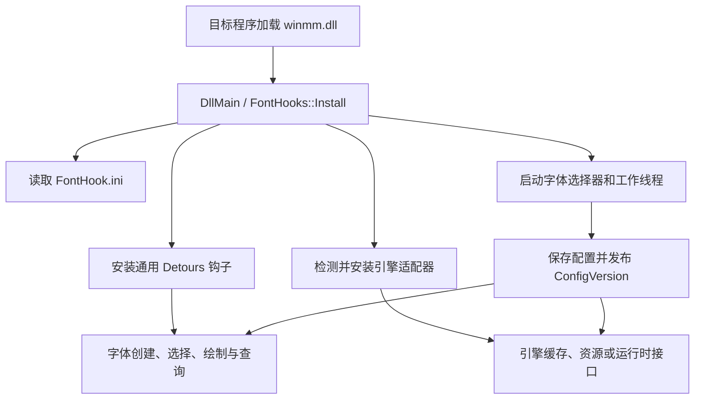

# 架构说明

## 总体结构

SimpleFontHook 生成名为 `winmm.dll` 的代理 DLL。Windows 加载代理后，`DllMain`
调用 `FontHooks::Install`，安装通用字体钩子和匹配的引擎适配器。系统 `winmm`
导出由 `winmm_proxy.h` 转发，字体功能与代理导出保持分离。

## 进程生命周期

1. `DLL_PROCESS_ATTACH` 禁止线程级 DLL 通知并调用 `FontHooks::Install`。
2. 安装流程读取配置、准备静态适配状态、开启 Detours 事务并按类别安装钩子。
3. Detours 提交后启动 Unity、Ren'Py、DirectWrite 延迟加载和字体选择器线程。
4. UI 修改配置后递增 `Config::ConfigVersion`，清理通用缓存并通知各引擎适配器。
5. 正常关闭流程停止工作线程并释放句柄。
6. `DLL_PROCESS_DETACH` 位于加载器锁内，只调用 `Utils::RequestShutdown()` 发布信号。

## 翻译单元策略

`hooks/font_hooks.cpp` 是钩子实现的聚合翻译单元。`hooks/internal/**/*.cppinc` 不单独
编译，而是按明确顺序包含。这使原始 API 指针、Detours 目标和引擎状态保持内部链接，
避免通过头文件暴露大量可变全局状态。

UI 使用相同策略：`ui/font_picker.cpp` 聚合 `ui/internal/` 下的状态、绘制、输入、
配置应用和生命周期分片。

## 模块接口

| 模块 | 对外接口 | 隐藏的实现 |
| --- | --- | --- |
| 进程入口 | `FontHooks::Install` | 安装顺序、Detours 事务、工作线程启动 |
| 配置 | `Utils::LoadConfig`、`SaveConfig` | UTF-8 INI 解析、默认值和兼容键读取 |
| 字体替换模型 | GDI/DirectWrite 钩子处理程序 | 替换缓存、逻辑字体视图、度量与字形虚拟化 |
| 字体表修改 | `FontPatcher::*` | SFNT/TTC 解析、表重建和校验和 |
| 文件适配 | `engine_file_dispatch.cppinc` | 引擎优先级、虚拟属性和重定向 |
| 引擎适配器 | `Install`、`Prepare`、`NotifyConfigChanged` 类入口 | 检测、缓存定位、运行时桥接和资源生成 |
| 字体选择器 | `FontPicker::Init`、`Shutdown` | 窗口状态、绘制、输入和字体枚举 |

## 字体替换与编码

字体替换、字符集伪装、代码页重定向和文字映射是四条独立路径：

- 字体替换修改字体名称、HFONT、字体数据或引擎字体资源。
- 字符集伪装修改字体请求和字体能力查询中暴露的字符集。
- 代码页重定向修改明确启用的 `MultiByteToWideChar`/`WideCharToMultiByte` 转换。
- 文字映射只在启用后将已解码 Unicode 字符映射为目标字符。

ANSI 文字映射优先采用原始字体创建阶段检测到的字符集。替换字体的字符集不能作为
源文本编码依据，配置的 `TextSubstitutionCodepage` 只在无法检测时回退使用。
YU-RIS 位图字体适配属于字体资源替换：适配器按已验证的 YPF 归档契约选择资源配置，
独立探测目录编码，再按 188/192/160 槽字节布局枚举兼容页表。它不读取解包目录，也不读取
`ForcedCharset`、`TextSubstitutionCodepage` 或代码页重定向配置；专用的
`YurisAtlasCodepage` 只覆盖页表字符映射，不改变资源布局。Big5 固定页表先独立解码为
Unicode；仅当通用文字映射已明确启用时，渲染字符才进入现有宽字符映射，字体替换本身
不隐式开启繁简转换。

## 缓存与热切换

`Config::ConfigVersion` 是运行时配置快照的版本号。缓存项记录创建时版本，读取路径只
接受当前版本的字体、度量和引擎资源。通用缓存可直接清理，引擎缓存通过钩子、消息或
运行时线程刷新。

不要使用字体名称作为唯一缓存失效条件。度量、字符集、文字映射和字体数据也可能在
字体名称不变时发生变化。

## 高频路径

字体创建、`SelectObject`、文本绘制、字形轮廓和文件查询都可能每帧调用。高频路径只
允许读取已缓存状态、进行有界查找和调用目标 API。模块扫描、PE 解析、ASAR 解析、
字体源解析、必要的资源生成和运行时类型解析必须缓存或移到准备/工作线程阶段。

## 引擎适配器

引擎适配器用于 GDI/DirectWrite 无法覆盖的渲染路径，或用于刷新引擎内部字体缓存。
适配器必须先通过稳定标记正向识别目标环境，再进行高开销操作。检测到通用字体 API
只能证明程序使用字体，不能证明其属于某个具体引擎。

识别流程把身份、能力和资源路由分开。共享扩展名与文件名只参与候选资源分类；模块
标记、运行时接口、框架结构或已解析归档中的引擎资源负责身份确认。适配器确认身份后
才处理对应文件请求，避免不同引擎使用相同后缀时互相进入专用逻辑。

### 三阶段决策记录

| 阶段 | 输入 | 允许的证据 | 输出 |
| --- | --- | --- | --- |
| 身份 | 主模块、已加载模块、目录和已解析容器 | 组合字符串、导入/导出、运行时框架结构、容器内专有资源 | 已确认身份或透传 |
| 能力 | 身份、版本、格式和目标 API | 可解析表结构、导出签名、运行时类型、资源布局 | 可安装能力集合或回退原因 |
| 路由 | 已确认身份和一次资源请求 | 规范化路径、容器条目、资源类型与配置快照 | 原资源、虚拟资源或生成资源 |

每次决策记录 `module`、`phase`、`decision`、`evidence`、`config_version` 和 `fallback`。
高频请求只读取身份与能力缓存；静态扫描、归档解析和运行时类型搜索在准备阶段完成。

### 从证据到实现

1. 固定样本哈希、架构、构建配置和 `FontHook.ini` 快照。
2. 记录适配器关闭时的 API、文件请求和渲染基线。
3. 分别收集身份、能力和路由证据，标明观测、推断和待确认项。
4. 将证据压缩为输入、前置条件、输出和失败行为组成的最小契约。
5. 在对应检测、文件分发、字体资源或运行时桥接边界实现契约。
6. 对正向、非目标、能力缺失和边界样本执行 Win32/x64 验证矩阵。

详细规则见 [hooks/internal/engines/README.md](../SimpleFontHook/hooks/internal/engines/README.md)。
证据等级、命令和记录模板见 [reproduction.md](reproduction.md)。
